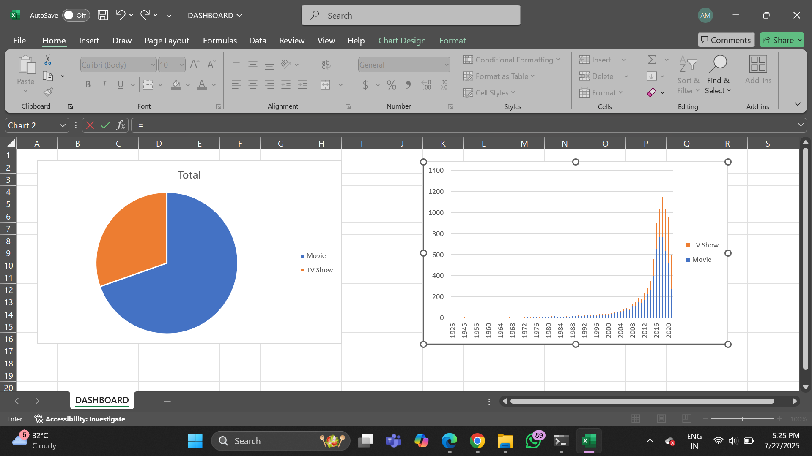
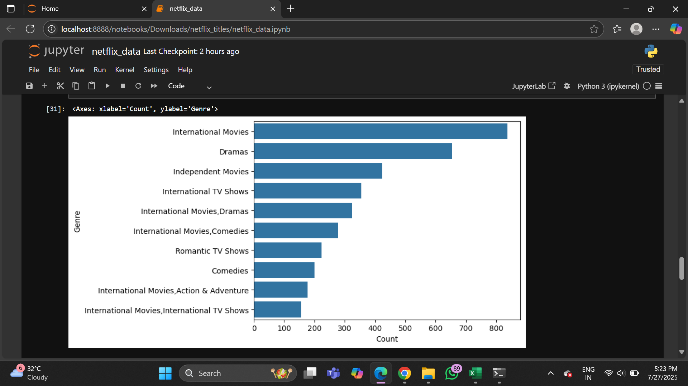

# netflix_data_analysis
# 🎬 Netflix Data Analysis Project

A complete data analysis project using **Excel** and **Python (Jupyter Notebook)** to explore, clean, and visualize insights from the Netflix titles dataset.

---

## 📁 Project Structure
Netflix_Data_Analysis/
├── netflix_titles.csv # Original dataset
├── netflix_data.ipynb # Jupyter Notebook for data cleaning & EDA
├── netflix_dashboard.xlsx # Excel dashboard with filters & charts
├── screenshots/ # Visuals from the Excel dashboard
└── README.md # Project documentation (this file)

---

## 🔍 Objective

The goal of this project is to:
- Clean and preprocess the raw Netflix dataset
- Perform exploratory data analysis (EDA) in Python
- Create an interactive Excel dashboard with filters (genre, rating, type, etc.)
- Provide useful business insights from the data

---

## 📊 Tools & Technologies Used

| Tool              | Purpose                           |
|-------------------|-----------------------------------|
| Python (Pandas, Seaborn) | Data cleaning, EDA, visualization |
| Jupyter Notebook   | Interactive data exploration     |
| Microsoft Excel    | Dashboard creation, Pivot Tables |
| GitHub             | Version control and sharing      |

---

## 📌 Key Features

### ✅ Jupyter Notebook:
- Null value handling (director, cast, rating, etc.)
- Genre extraction and cleaning
- Visualizations using Seaborn & Matplotlib

### ✅ Excel Dashboard:
- Cleaned dataset with TRIM, LEFT, and helper formulas
- Genre-based movie filtering with `FILTER()` function
- Dynamic recommendations (Title, Type, Rating)
- Pivot charts for visual insights (Genre count, Type distribution, etc.)

---

## 📸 Screenshots

> *(Add screenshots of your dashboard and notebook visuals inside `screenshots/` folder.)*

---

## 📂 Dataset

The dataset used is from [Netflix Titles](https://www.kaggle.com/datasets/shivamb/netflix-shows).  
It contains information like:
- Title
- Type (Movie/TV Show)
- Director, Cast
- Country, Date Added
- Rating
- Duration
- Listed in (Genres)

---

## 🚀 How to Use

1. Clone this repository or download as ZIP
2. Open `netflix_cleaned.ipynb` in Jupyter Notebook
3. Open `netflix_dashboard.xlsx` in Excel
4. Use dropdown to select Genre → See filtered recommendations

---

## 📈 Insights Discovered

- Most common genre: Drama & Comedy
- Movies dominate over TV Shows
- U.S. has the highest number of titles
- TV Shows are increasing after 2016

---

## 🙌 Acknowledgements

- Dataset from Kaggle
- Excel formulas and logic inspired by real-world business dashboards
- Jupyter visuals inspired by beginner EDA projects

---

## 👤 Author

**AARZOO MAURYA**  
📧 Email: response2aarzoo@gmail.com  
🔗 GitHub: [github.com/aarzoo09](https://github.com/aarzoo09)

---

